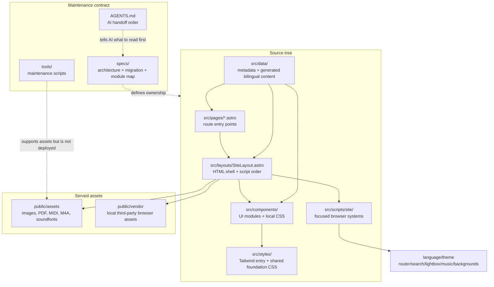
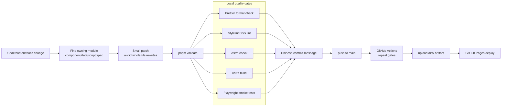
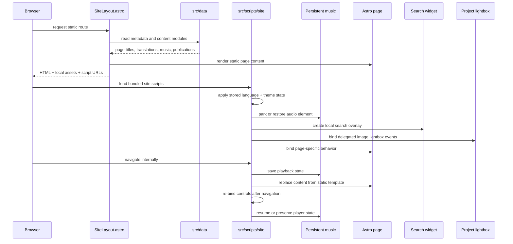
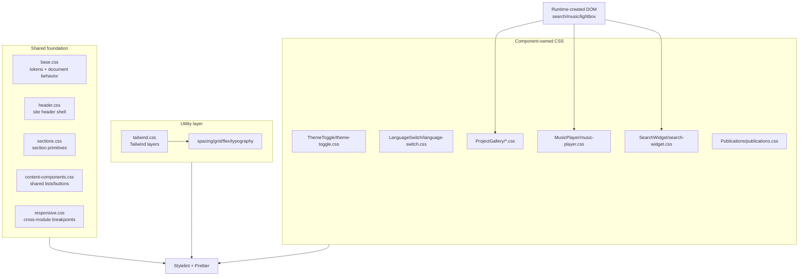
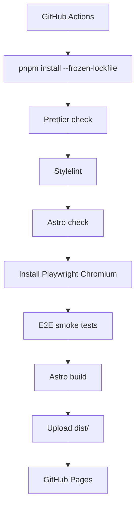

# billzi2016.github.io

Source code for my personal academic website.

## Websites

- Public website: [https://billzi2016.github.io/](https://billzi2016.github.io/)
- MkDocs maintenance documentation: [https://billzi2016.github.io/docs/](https://billzi2016.github.io/docs/)

## Maintenance Documents

- Chinese documentation: [README.zh.md](README.zh.md)
- AI maintenance guide: [AGENTS.md](AGENTS.md)
- Maintenance documentation site source: [docs-site/](docs-site/)
- Chinese maintenance entry: [docs-site/docs/zh/](docs-site/docs/zh/)
- English maintenance entry: [docs-site/docs/en/](docs-site/docs/en/)
- Documentation-site PRDs: [docs-site/docs/specs/](docs-site/docs/specs/)

## Overview

This is an Astro-based static academic portfolio website covering research interests, technical skills, projects, publications, experience, education, personal interests, and a small local music page.

The repository is maintained as a production-quality static frontend system rather than a collection of loose pages. It combines Astro static generation, Tailwind CSS, component-local styling, local assets, PhotoSwipe project lightbox behavior, Playwright smoke tests, Stylelint, Prettier, pnpm, and GitHub Actions deployment.

The project specs document the module boundaries, Astro migration, Tailwind/CSS policy, and engineering rules that keep the codebase maintainable.

This repository demonstrates production-grade frontend maintenance discipline for a personal academic website:

- Static generation with Astro and Vite, while keeping the deployed site as GitHub Pages-friendly static output.
- Tailwind CSS plus ownership-based component styling, replacing ad-hoc global CSS accumulation with shared foundations, utility classes, and component-owned CSS.
- Local asset governance for images, audio, MIDI, soundfonts, PDFs, and vendor browser scripts such as PhotoSwipe, avoiding CDN dependency for the public site.
- MkDocs maintenance documentation that makes the repository architecture, workflows, and historical decisions navigable.
- README, AGENTS, specs, and module maps that make the system maintainable by both humans and AI agents.
- Playwright smoke tests for fragile user-facing interactions such as language/theme switching, local search, music controls, and PhotoSwipe image lightbox behavior.
- Prettier, Stylelint, Astro check, build validation, release tagging, and lightweight trunk-based development.

## Technical Stack

- Astro + Vite for static routing, layout composition, bundling, and GitHub Pages output.
- Tailwind CSS for utility styling, with component-local CSS for complex visual systems.
- TypeScript-enabled Astro checks for template and type diagnostics.
- Browser runtime modules for language switching, theme switching, page transitions, local search, PhotoSwipe image lightbox behavior, animated backgrounds, and persistent music playback.
- Local assets for images, audio, MIDI, soundfonts, and PhotoSwipe vendor scripts.
- Playwright smoke tests for core page rendering and fragile interactions.
- Prettier and Stylelint for formatting and CSS quality gates.
- pnpm and GitHub Actions for reproducible install, validation, build, and deployment.

## Architecture

The first diagram shows the static-site architecture. Astro owns routes and document composition, data modules feed both static rendering and runtime initialization, while browser scripts are kept as focused systems instead of a full SPA runtime.



The second diagram is the normal engineering workflow. Local validation and CI intentionally run the same quality gates so a change that passes locally should behave the same way before deployment.



## Trunk-Based Maintenance Contract

Spec and user instructions are the source of truth for this repository. Maintenance work must preserve the requested workflow and architecture, even when a faster shortcut appears available.

- Use a short-lived feature branch for non-trivial changes, keep the branch visible, and merge it back to `main` with an explicit non-fast-forward merge commit.
- Do not replace the requested workflow with a fast-forward merge when the task requires a visible branch/merge history.
- Run the real validation path for the repository, especially `pnpm validate`, instead of using mock checks or partial shortcuts as a substitute for the requested gates.
- Keep implementation DRY and aligned with existing modules; do not create parallel logic, duplicate data paths, or temporary alternatives that make ownership unclear.
- Follow SOLID-style boundaries for components, runtime systems, data modules, and styles: extend the owning module instead of adding a second competing system.
- Name branches deliberately. A branch name may be longer when needed, but it must describe the actual topic and scope in a reviewable way; do not use vague names such as `fix`, `update`, `temp`, or random shorthand.
- Write commit and merge messages with clear intent. A message must explain what changed and why it matters in plain language, using the discipline expected for reviewable kernel-style history; do not use abbreviations, placeholder wording, or one-word summaries.
- Avoid `git reset --hard` as a normal workflow tool. It is a high-risk operation and should only be used when the user explicitly asks for it, the impact has been explained, and no safer path fits the task.
- If a spec, AGENTS rule, or user instruction conflicts with a convenient implementation shortcut, the spec and instruction win.

Required command flow for a feature change:

```bash
git switch main
git pull --ff-only origin main
git switch -c feature/<descriptive-topic-and-scope>
pnpm validate
git add <changed-files>
git commit -m "<Chinese message explaining intent and scope>"
git push origin feature/<descriptive-topic-and-scope>
git switch main
git merge --no-ff feature/<descriptive-topic-and-scope> -m "<Chinese merge message explaining the integrated feature>"
git push origin main
```

The runtime lifecycle is deliberately narrow: Astro renders static HTML, then small browser modules attach behavior. The music player is treated specially so page transitions do not recreate or interrupt playback unnecessarily.



The persistent music runtime is designed so navigation does not recreate playback from scratch. `site-music.js` owns the current track, volume, playback time, and playing state; `site-router.js` saves that state before partial navigation; and the existing audio element is parked or restored into the next player container instead of being discarded. Floating music controls and the full music page share this runtime contract, so route changes can replace page content without causing the audio source to reload or the track to stutter.

CSS is split by ownership rather than by a single global stylesheet. Shared CSS is limited to foundations; complex visual systems keep their CSS beside the component or runtime system that owns the DOM.



The deployment pipeline turns the repository rules into automated enforcement. Formatting, CSS quality, Astro diagnostics, browser smoke tests, and the production build must all pass before GitHub Pages receives a new `dist/` artifact.



## Evolution

This site started as a traditional static website written with plain HTML, CSS, and JavaScript. That approach was simple and reliable, but the CSS and repeated page structure became harder to maintain as the site grew.

The current version has been migrated to Astro with Tailwind CSS. Astro keeps the output as static HTML, which fits a personal academic website well: the pages load quickly, deploy cleanly to GitHub Pages, and do not require a large client-side application runtime. Tailwind is used as an engineering layer for more maintainable layout and utility styling, while the existing visual design is preserved.

This project does not use Vue or React as the primary framework because the site is mostly content, navigation, images, publications, and lightweight interaction. A full single-page application framework would add more client-side JavaScript and more architectural overhead than this site needs. Astro gives the useful parts of component-based development without turning the website into a heavy SPA. If a future section needs richer interactive UI, Astro can still host focused client-side components where they are actually needed.

| Dimension               | Original HTML / CSS / JS static site                                                          | Current Astro + Tailwind CSS site                                                                              | Vue / React SPA-style approach                                                                                                   |
| ----------------------- | --------------------------------------------------------------------------------------------- | -------------------------------------------------------------------------------------------------------------- | -------------------------------------------------------------------------------------------------------------------------------- |
| Page speed              | Very fast for small pages, but repeated markup and growing CSS made long-term cleanup harder. | Fast static HTML output with component-based source files and limited runtime JavaScript.                      | Can be fast when optimized, but usually ships more JavaScript than this site needs.                                              |
| JavaScript payload      | Minimal at first, then gradually accumulated page renderers and runtime helpers.              | JavaScript is kept for language switching, music continuity, search, lightbox, and other focused interactions. | More client-side runtime by default, especially if the whole site becomes an SPA.                                                |
| Maintainability         | Simple files, but duplicated structure and CSS growth made changes risky.                     | Components, data modules, Tailwind utilities, and split CSS make the project easier to inspect and maintain.   | Strong component model, but introduces state management and app-level structure that is unnecessary for this content-heavy site. |
| SEO and static output   | Static HTML works well, but pages were manually maintained.                                   | Static HTML remains the deployment target, with Astro generating pages from cleaner source structure.          | Needs SSR, SSG, or careful prerendering to match the same static-site behavior cleanly.                                          |
| GitHub Pages deployment | Easy, but relied on manually organized static assets.                                         | Easy: `pnpm build` generates `dist/`, and GitHub Actions deploys the static output.                            | Also possible, but the build/runtime model is heavier for this use case.                                                         |
| Visual preservation     | Original visual design was built here.                                                        | The migration keeps the existing visual design while improving the source structure.                           | A rewrite in Vue or React would create more risk of accidental visual drift.                                                     |
| Best fit                | Small, stable static pages.                                                                   | Personal academic website with mostly static content and selective interactions.                               | Large interactive applications, dashboards, editors, or products with complex client-side state.                                 |

## Pages

- `index.html`: Home
- `experience.html`: Experience and education
- `projects.html`: Project portfolio
- `publications.html`: Publications
- `personal.html`: Personal introduction
- `music.html`: Music page

## Structure

- `src/pages/`: Astro page entry points.
- `src/layouts/`: Shared Astro layout.
- `src/components/`: Header, content sections, image galleries, lists, and other reusable UI components. Complex components can own local CSS in the same directory.
- `src/data/`: Site metadata, navigation links, and generated content modules used by Astro.
- `src/scripts/site/`: Browser runtime modules loaded through Astro/Vite.
- `src/styles/tailwind.css`: Tailwind entry file.
- `src/styles/site/`: Shared foundation CSS imported by Astro through `src/styles/site/main.css`.
- `public/assets/`: Local images, audio, MIDI files, PDF, and asset documentation.
- `public/vendor/`: Third-party browser assets that are loaded directly, including localized PhotoSwipe CSS and UMD scripts.
- `tools/`: Repository maintenance scripts that should not be published as site assets.
- `AGENTS.md`: AI maintenance entrypoint and reading order.

## Project Specs

These specs are part of the repository contract. Read them before large refactors or AI-assisted maintenance:

| English                                                   | 中文                                               |
| --------------------------------------------------------- | -------------------------------------------------- |
| [Maintenance Plan](specs/maintenance-plan.md)             | [维护方案](specs/maintenance-plan.zh.md)           |
| [Module Map](specs/module-map.md)                         | [模块地图](specs/module-map.zh.md)                 |
| [Astro Migration Plan](specs/astro-migration-plan.md)     | [Astro 迁移方案](specs/astro-migration-plan.zh.md) |
| [Engineering Principles](specs/engineering-principles.md) | [工程原则](specs/engineering-principles.zh.md)     |

They cover the Astro architecture, Tailwind usage, SOLID/DRY rules, CSS ownership, JavaScript ownership, deployment model, testing checklist, and migration history.

## Branching Workflow

After `v1.0.0-astro-tailwind-docs-stable-2026-07-06`, new feature work follows a lightweight trunk-based workflow:

This repository started with a fast-moving personal static-site workflow. After the `v1.0.0` Astro/Tailwind/MkDocs stabilization release, it formally converges on this lightweight trunk-based workflow.

- `main` stays deployable and is treated as the stable trunk.
- Functional, styling, build, documentation-site, and architecture changes should use short-lived `feature/...` branches.
- Finish one feature branch, merge it back to `main`, then start the next one. Avoid long-running parallel feature branches for this single-maintainer project.
- Prefer `git merge --no-ff feature/name` when merging a completed feature so the Git graph preserves the feature boundary.
- Small README, metadata, release-note, or repository bookkeeping updates may go directly to `main` when they do not affect the built website.

## Local Development

```bash
pnpm install
pnpm dev
```

Then open the local Astro dev server, usually `http://localhost:4321/`.

To bind an explicit host and port:

```bash
pnpm dev --host 127.0.0.1 --port 4321
```

## Build

```bash
pnpm build
```

Astro writes the generated static site to `dist/`.

Preview the production build locally:

```bash
pnpm preview
```

Run Astro diagnostics:

```bash
pnpm check
```

Run formatting, CSS lint, Astro check, build, and Playwright smoke tests:

```bash
pnpm validate
```

## Deployment

The site is built with GitHub Actions and deployed to GitHub Pages from the generated Astro output.

## Data Organization

Content data used by Astro lives under:

- `src/data/generated/sharedContent.js`
- `src/data/generated/homeContent.js`
- `src/data/generated/experienceContent.js`
- `src/data/generated/projectsContent.js`
- `src/data/generated/publicationsData.js`
- `src/data/generated/musicLibrary.js`
- `src/data/generated/siteI18n.js`

Astro renders the visible page content and language templates from these modules. The layout also inlines the small runtime data object needed for language switching, music playback continuity, site search, PhotoSwipe image lightbox behavior, and publication citation buttons. The old browser-side page renderers and duplicated public data scripts have been removed.

## Demo Gallery

### Chinese Homepage in Dark Theme


### Chinese Homepage in Light Theme


### English Homepage in Dark Theme


### English Homepage in Light Theme


### Industry Experience Detail


### Research Experience and Monitoring Platform


### Personal Introduction and Hardware Projects


### Publications Page


### Projects Page


