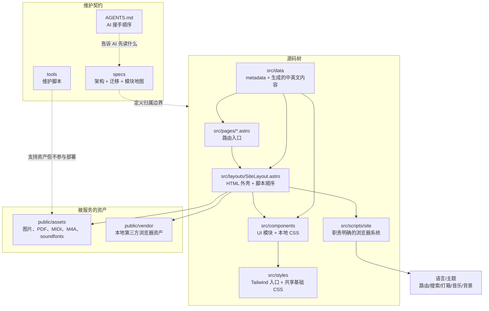
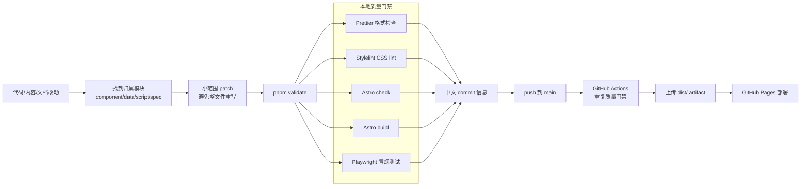
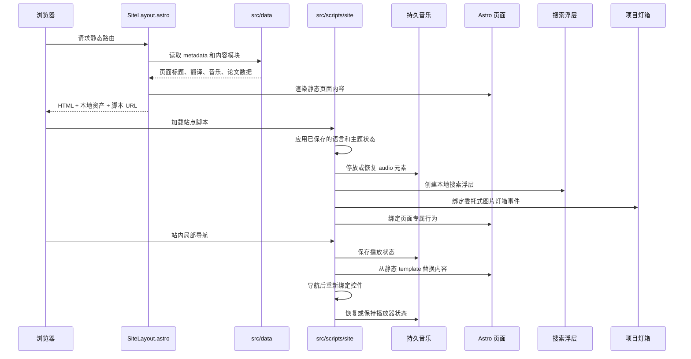
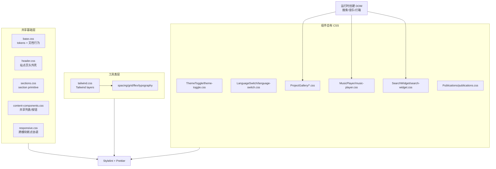
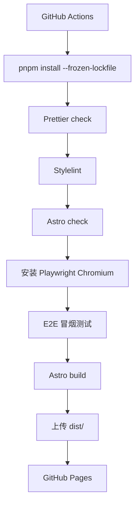

# billzi2016.github.io

我的个人学术网站源代码。

## 网站

- 公开网站：[https://billzi2016.github.io/](https://billzi2016.github.io/)
- MkDocs 维护文档站：[https://billzi2016.github.io/docs/](https://billzi2016.github.io/docs/)

## 维护文档

- 英文文档：[README.md](README.md)
- AI 维护指南：[AGENTS.md](AGENTS.md)
- 维护文档站源码：[docs-site/](docs-site/)
- 中文维护入口：[docs-site/docs/zh/](docs-site/docs/zh/)
- 英文维护入口：[docs-site/docs/en/](docs-site/docs/en/)
- 文档站 PRD：[docs-site/docs/specs/](docs-site/docs/specs/)

## 概述

这是一个基于 Astro 的静态学术作品集网站，覆盖研究兴趣、技术技能、项目、论文、经历、教育背景、个人兴趣和一个本地音乐页面。

这个仓库按可部署的静态前端系统维护，而不是一组松散页面。它组合了 Astro 静态生成、Tailwind CSS、组件本地样式、本地资产、PhotoSwipe 项目灯箱、Playwright 冒烟测试、Stylelint、Prettier、pnpm 和 GitHub Actions 部署。

项目规范文档记录模块边界、Astro 迁移过程、Tailwind/CSS 策略，以及保持代码库可维护的工程规则。

这个仓库把个人主页维护到生产级前端工程标准：

- 使用 Astro 和 Vite 做静态生成，同时保持适合 GitHub Pages 部署的静态输出。
- 使用 Tailwind CSS 和按归属拆分的组件样式，把随手堆全局 CSS 的模式整理为共享基础层、工具类和组件自有 CSS。
- 本地资产治理覆盖图片、音频、MIDI、soundfonts、PDF 和 PhotoSwipe 等 vendor 浏览器脚本，公开网站避免依赖 CDN。
- MkDocs 维护文档站让仓库架构、维护流程和历史决策可导航、可追溯。
- README、AGENTS、specs 和 module map 让系统可以被人类和 AI agent 持续维护。
- Playwright 冒烟测试覆盖语言/主题切换、本地搜索、音乐控制和 PhotoSwipe 图片灯箱等脆弱用户交互。
- Prettier、Stylelint、Astro check、构建验证、版本里程碑和轻量 trunk-based 开发流程形成质量门禁。

## 技术栈

- Astro + Vite：负责静态路由、layout 组合、打包和 GitHub Pages 输出。
- Tailwind CSS：处理工具类样式；复杂视觉系统使用组件本地 CSS。
- TypeScript-enabled Astro check：提供模板和类型诊断。
- 浏览器运行时模块：负责语言切换、主题切换、页面切换、本地搜索、PhotoSwipe 图片灯箱、动态背景和持久音乐播放。
- 本地资产：图片、音频、MIDI、soundfonts 和 PhotoSwipe vendor 脚本全部本地化。
- Playwright：覆盖核心页面渲染和脆弱交互的冒烟测试。
- Prettier + Stylelint：约束格式和 CSS 质量。
- pnpm + GitHub Actions：负责可复现安装、验证、构建和部署。

## 架构图

第一张图展示静态站架构。Astro 负责路由和文档组合，数据模块同时服务静态渲染和运行时初始化；浏览器脚本被拆成几个职责明确的小系统，而不是把整站做成 SPA runtime。



第二张图是正常工程工作流。本地验证和 CI 使用同一组质量门禁，所以本地通过的改动，推送后也会用同样规则再次检查。



## Trunk-Based 维护契约

spec 和用户指令是这个仓库的最高事实来源。维护工作必须保留被要求的流程和架构，不能因为某条捷径看起来更快就替换掉原始要求。

- 非平凡改动使用短生命周期 feature 分支，保留可见分支，并用明确的 non-fast-forward merge commit 合回 `main`。
- 如果任务要求能看到分支和合并历史，不允许用 fast-forward merge 替代。
- 使用仓库真实验证路径，尤其是 `pnpm validate`；不能用 mock 检查、局部快速检查或临时脚本冒充要求的质量门禁。
- 保持实现 DRY，并遵守现有模块归属；不要制造平行逻辑、重复数据路径或临时替代系统，避免后续分不清哪个才是主逻辑。
- 组件、运行时系统、数据模块和样式都按 SOLID 风格边界维护：扩展拥有该职责的模块，而不是新增一套竞争实现。
- 分支名必须认真命名。必要时可以长一点，但必须准确描述真实主题和影响范围，方便审查；不要使用 `fix`、`update`、`temp` 或随手缩写这种含糊名字。
- commit 和 merge 信息必须讲清楚意图。信息要用清楚的中文说明改了什么、为什么重要，符合可审查的 kernel-style 历史纪律；不要使用缩写、占位词或一个词带过。
- 尽可能不要把 `git reset --hard` 当作常规工作流工具。它是高风险操作，只有用户明确要求、已经说明影响、并且没有更安全方案时才允许使用。
- 当 spec、AGENTS 规则或用户指令与某个方便的实现捷径冲突时，必须以 spec 和指令为准。

feature 改动必须使用下面的命令流程：

```bash
git switch main
git pull --ff-only origin main
git switch -c feature/<descriptive-topic-and-scope>
pnpm validate
git add <changed-files>
git commit -m "<说明意图和范围的中文提交信息>"
git push origin feature/<descriptive-topic-and-scope>
git switch main
git merge --no-ff feature/<descriptive-topic-and-scope> -m "<说明集成功能的中文合并提交信息>"
git push origin main
```

运行时生命周期很窄：Astro 先输出静态 HTML，然后少量浏览器模块挂载行为。音乐播放器被特殊处理，页面切换时不会被无意义重建或打断。



持久音乐运行时的设计目标，是让站内导航不需要从零重建播放。`site-music.js` 负责当前曲目、音量、播放时间和播放状态；`site-router.js` 在局部导航前保存状态；已有 audio 元素会被停放或恢复到下一个播放器容器，而不是被丢弃。浮动音乐控件和完整音乐页共享这套运行时契约，所以页面内容可以被替换，但音频源不需要重新加载，播放也不容易卡顿。

CSS 按归属拆分，而不是继续堆进一个大全局文件。共享 CSS 只保留基础层；复杂视觉系统的 CSS 跟随拥有该 DOM 的组件或运行时系统。



部署流水线把仓库规则变成机器约束。格式、CSS 质量、Astro 诊断、浏览器冒烟测试和生产构建都通过后，GitHub Pages 才会收到新的 `dist/` artifact。



## 技术演化

这个网站最开始是传统的原生静态站，主要由 HTML、CSS 和 JavaScript 组成。这个方案简单、稳定，也很适合早期个人主页；但随着页面、内容和样式不断增加，CSS 和重复页面结构逐渐变得难维护。

当前版本已经迁移到 Astro 和 Tailwind CSS。Astro 仍然输出静态 HTML，非常适合个人学术主页：页面加载快，可以干净地部署到 GitHub Pages，也不需要引入大型前端运行时。Tailwind CSS 则作为工程化样式层使用，让布局和局部样式更容易维护，同时尽量保留原有视觉效果。

这个项目没有把 Vue 或 React 作为主框架，是因为网站主体仍然是内容、导航、图片、论文列表和轻量交互，并不是复杂后台或重交互单页应用。直接使用 Vue / React 会带来更多客户端 JavaScript 和更多架构负担。Astro 可以提供组件化开发的好处，同时避免把个人主页变成过重的 SPA。如果未来某个区域真的需要复杂交互，Astro 也可以按需接入局部客户端组件。

| 维度              | 最早的 HTML / CSS / JS 静态站                                 | 当前 Astro + Tailwind CSS 方案                                                    | Vue / React 单页应用式方案                                                   |
| ----------------- | ------------------------------------------------------------- | --------------------------------------------------------------------------------- | ---------------------------------------------------------------------------- |
| 页面速度          | 小页面阶段很快，但随着重复结构和 CSS 增长，长期清理成本变高。 | 输出仍然是静态 HTML，首屏快，同时源码具备组件化结构，运行时 JavaScript 保持克制。 | 经过优化也可以很快，但通常会带来比这个网站实际需要更多的客户端 JavaScript。  |
| JavaScript 负载   | 最开始很少，后来逐渐积累页面渲染脚本和运行时辅助逻辑。        | JavaScript 主要保留给语言切换、音乐连续播放、站内搜索、灯箱等明确交互。           | 默认需要更多前端运行时，如果整站做成 SPA，会增加额外负担。                   |
| 可维护性          | 文件直观，但页面结构重复、CSS 增长后，改动风险越来越高。      | 组件、数据模块、Tailwind 工具类和拆分 CSS 让源码更容易阅读、维护和审查。          | 组件模型很强，但会引入对这个内容型网站来说不必要的应用结构和状态管理复杂度。 |
| SEO 与静态输出    | 静态 HTML 本身适合 SEO，但页面需要手动维护。                  | 仍以静态 HTML 作为部署目标，由 Astro 从更干净的源码结构生成页面。                 | 需要 SSR、SSG 或额外预渲染配置，才能优雅达到同样的静态站效果。               |
| GitHub Pages 部署 | 部署简单，但资源和页面结构主要靠人工组织。                    | 部署简单：`pnpm build` 生成 `dist/`，GitHub Actions 发布静态输出。                | 也可以部署，但对于这个网站来说构建和运行模型偏重。                           |
| 视觉保持          | 原始视觉就是在这个阶段形成的。                                | 迁移时保留现有视觉效果，同时改善源码结构。                                        | 如果整体重写成 Vue 或 React，更容易产生不必要的视觉偏移。                    |
| 适用场景          | 小型、稳定、改动少的静态页面。                                | 以内容为主、有少量交互的个人学术主页。                                            | 大型交互应用、后台、编辑器、仪表盘或复杂客户端状态产品。                     |

## 页面

- `index.html`：主页
- `experience.html`：经历与教育背景
- `projects.html`：项目作品集
- `publications.html`：论文
- `personal.html`：个人介绍
- `music.html`：音乐页面

## 结构

- `src/pages/`：Astro 页面入口。
- `src/layouts/`：公共 Astro 布局。
- `src/components/`：页头、内容区块、图片画廊、列表和其他可复用 UI 组件。复杂组件可以在同目录拥有本地 CSS。
- `src/data/`：站点元数据、导航链接，以及 Astro 使用的生成数据模块。
- `src/scripts/site/`：通过 Astro/Vite 加载的浏览器运行时模块。
- `src/styles/tailwind.css`：Tailwind 入口文件。
- `src/styles/site/`：共享基础 CSS，由 Astro 通过 `src/styles/site/main.css` 引入。
- `public/assets/`：本地图片、音频、MIDI、PDF 和资源说明文档。
- `public/vendor/`：需要浏览器直接加载的第三方资源，包括本地化的 PhotoSwipe CSS 和 UMD 脚本。
- `tools/`：仓库维护脚本，不应该作为站点资产发布。
- `AGENTS.md`：AI 维护入口和文档阅读顺序。

## 项目规范

这些 specs 是仓库维护契约的一部分。大重构或 AI 辅助维护前应先阅读：

| 中文                                               | English                                                   |
| -------------------------------------------------- | --------------------------------------------------------- |
| [维护方案](specs/maintenance-plan.zh.md)           | [Maintenance Plan](specs/maintenance-plan.md)             |
| [模块地图](specs/module-map.zh.md)                 | [Module Map](specs/module-map.md)                         |
| [Astro 迁移方案](specs/astro-migration-plan.zh.md) | [Astro Migration Plan](specs/astro-migration-plan.md)     |
| [工程原则](specs/engineering-principles.zh.md)     | [Engineering Principles](specs/engineering-principles.md) |

它们覆盖 Astro 架构、Tailwind 用法、SOLID/DRY 原则、CSS 归属、JavaScript 归属、部署模型、测试检查清单和迁移历史。

## 分支工作流

从 `v1.0.0-astro-tailwind-docs-stable-2026-07-06` 之后，新的功能性工作遵守轻量 trunk-based 工作流：

这个仓库早期采用快速迭代的个人静态站维护方式；在 `v1.0.0` 的 Astro/Tailwind/MkDocs 稳定版之后，正式收敛为这个轻量 trunk-based 工作流。

- `main` 保持可部署状态，作为稳定主线。
- 功能、样式、构建、文档站和架构类改动应使用短生命周期 `feature/...` 分支。
- 一个 feature 分支做完后合并回 `main`，再开始下一个；这个单人维护项目不长期并行多个 feature 分支。
- 合并完成的 feature 时，优先使用 `git merge --no-ff feature/name`，让 Git 图保留清晰的 feature 边界。
- 小型 README、元数据、release note 或仓库整理类改动，在不影响网站构建结果时可以直接进入 `main`。

## 本地开发

```bash
pnpm install
pnpm dev
```

然后打开本地 Astro 开发服务器，通常是 `http://localhost:4321/`。

如果需要指定 host 和端口：

```bash
pnpm dev --host 127.0.0.1 --port 4321
```

## 构建

```bash
pnpm build
```

Astro 会把生成后的静态站点写入 `dist/`。

本地预览生产构建：

```bash
pnpm preview
```

运行 Astro 检查：

```bash
pnpm check
```

运行格式检查、CSS lint、Astro 检查、构建和 Playwright 冒烟测试：

```bash
pnpm validate
```

## 部署

网站通过 GitHub Actions 构建，并将 Astro 生成的静态输出部署到 GitHub Pages。

## 数据组织

Astro 使用的内容数据位于：

- `src/data/generated/sharedContent.js`
- `src/data/generated/homeContent.js`
- `src/data/generated/experienceContent.js`
- `src/data/generated/projectsContent.js`
- `src/data/generated/publicationsData.js`
- `src/data/generated/musicLibrary.js`
- `src/data/generated/siteI18n.js`

Astro 会用这些模块渲染可见页面内容和中英文模板。布局层也会内联一个很小的运行时数据对象，用于语言切换、音乐播放连续性、站内搜索、PhotoSwipe 图片灯箱和论文引用按钮。旧的浏览器端整页渲染脚本和重复 public 数据脚本已经移除。

## 演示图片

### 中文主页深色主题


### 中文主页浅色主题


### 英文主页深色主题


### 英文主页浅色主题


### 工业经历详情


### 科研经历与监测平台


### 个人介绍与硬件项目


### 论文页面


### 项目页面


