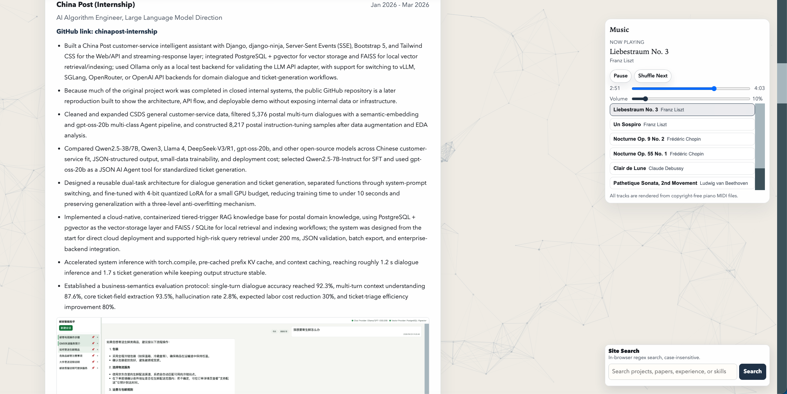
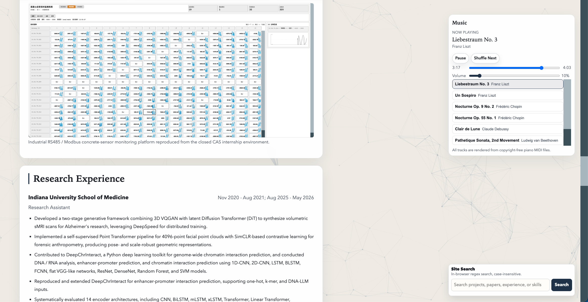
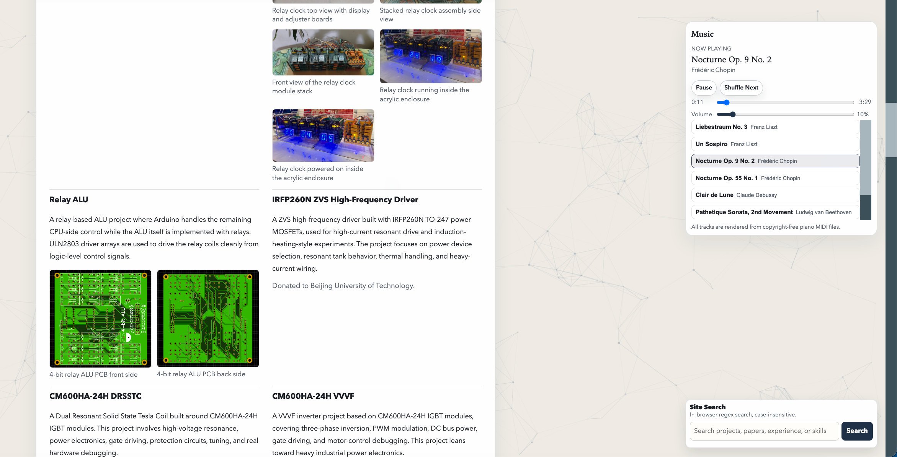
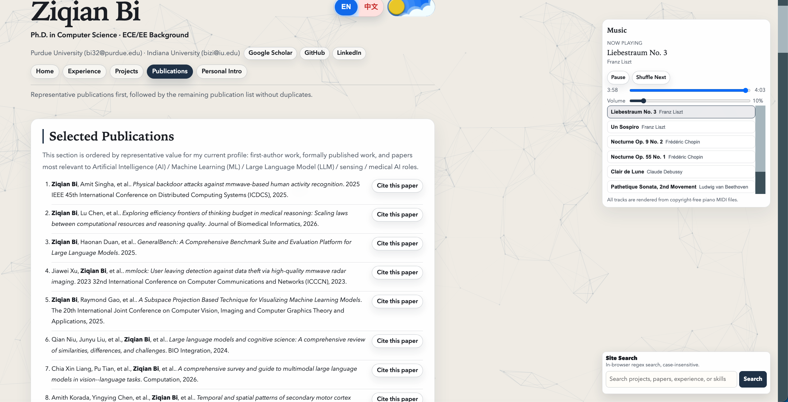
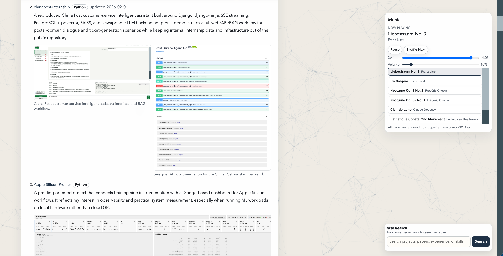

# billzi2016.github.io

我的个人学术网站源代码。

网站地址：[https://billzi2016.github.io/](https://billzi2016.github.io/)

英文文档：[README.md](README.md)

## 概述

这是一个基于 Astro 的静态学术作品集网站，覆盖研究兴趣、技术技能、项目、论文、经历、教育背景、个人兴趣和一个本地音乐页面。

## 页面

- `index.html`：主页
- `experience.html`：经历与教育背景
- `projects.html`：项目作品集
- `publications.html`：论文
- `personal.html`：个人介绍
- `music.html`：音乐页面

## 结构

- `src/pages/`：Astro 页面入口。
- `src/layouts/`：公共 Astro 布局。
- `src/components/`：页头、内容区块、图片画廊、列表和其他可复用 UI 组件。
- `src/data/`：站点元数据、导航链接，以及 Astro 使用的生成数据模块。
- `src/styles/tailwind.css`：Tailwind 入口文件。
- `public/styles/`：兼容旧结构的拆分 CSS，由 `public/styles/main.css` 统一引入。
- `public/scripts/`：主题切换、语言切换、音乐播放、搜索、路由、论文引用和图片灯箱等运行时逻辑。
- `public/assets/`：本地图片、音频、MIDI、PDF 和资源说明文档。

## 本地开发

```bash
pnpm install
pnpm dev
```

然后打开本地 Astro 开发服务器，通常是 `http://localhost:4321/`。

如果需要指定 host 和端口：

```bash
pnpm dev --host 127.0.0.1 --port 4321
```

## 构建

```bash
pnpm build
```

Astro 会把生成后的静态站点写入 `dist/`。

本地预览生产构建：

```bash
pnpm preview
```

运行 Astro 检查：

```bash
pnpm exec astro check
```

## 部署

网站通过 GitHub Actions 构建，并将 Astro 生成的静态输出部署到 GitHub Pages。

## 数据组织

运行时兼容数据仍保留在：

- `public/scripts/data/shared-data.js`
- `public/scripts/data/home-data.js`
- `public/scripts/data/experience-data.js`
- `public/scripts/data/projects-data.js`
- `public/scripts/music-data.js`
- `public/scripts/publications-data.js`

Astro 使用的生成数据模块位于 `src/data/generated/`。当前仍保留运行时 JavaScript，用于语言切换、音乐播放连续性、站内搜索、图片灯箱和论文引用按钮。

## 演示图片

### 中文主页深色主题


### 中文主页浅色主题


### 英文主页深色主题


### 英文主页浅色主题


### 工业经历详情



### 科研经历与监测平台



### 个人介绍与硬件项目



### 论文页面



### 项目页面


